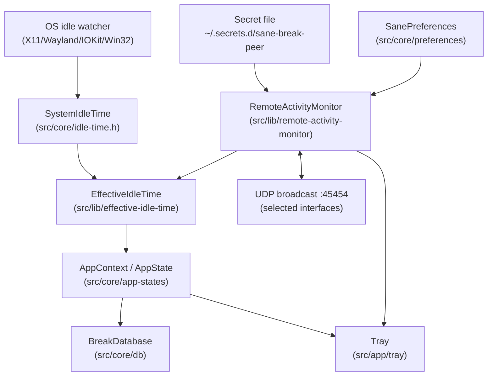
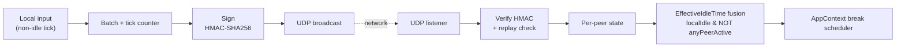
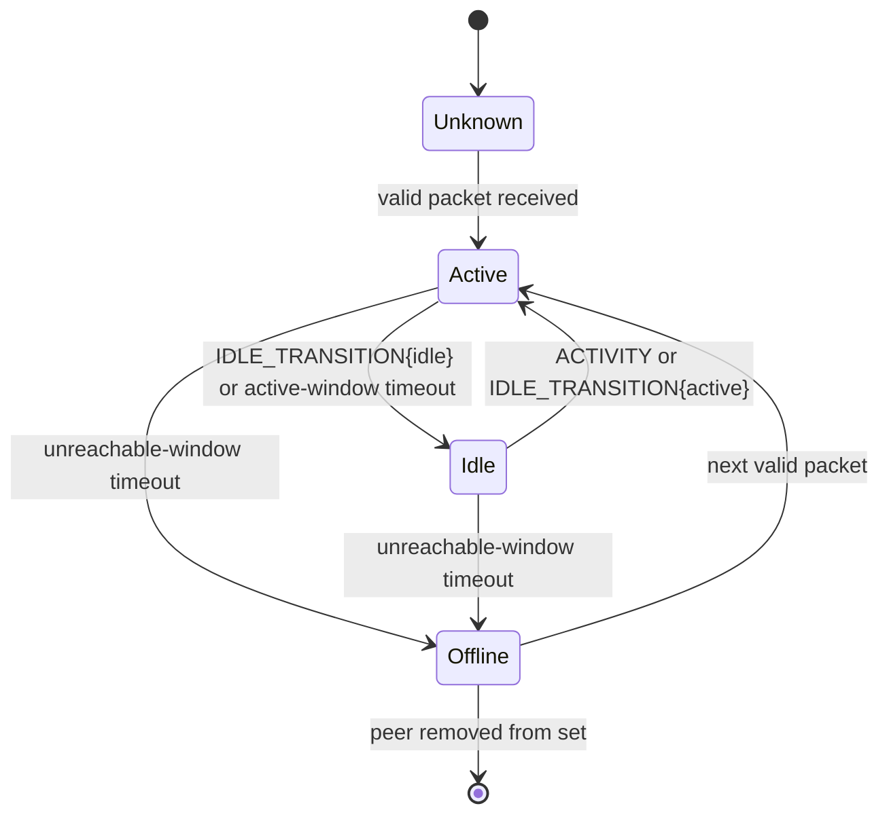

# Cross-Machine Activity Fusion Requirements

> **Status**: draft
> **Depends on**: none
> **Domain**: infrastructure
> **Keywords**: peer, activity, udp, broadcast, hmac, idle, kvm, multi-host, fusion, signed-packets
> **Provides**: remote-activity-monitor, effective-idle-time, peer-idle-fusion, host-attribution, signed-udp-broadcast, shared-secret-provisioning
> **Implemented**:
>
> Peer-to-peer signed UDP activity broadcasting so sane-break instances on KVM-switched workstations share a unified idle/active view and schedule breaks against combined work time.

## Introduction

Sane Break tracks idle time through OS-native watchers (XScreenSaver / `ext-idle-notify` on Linux, IOKit on macOS, GetLastInputInfo on Windows) and schedules breaks from per-process SQLite state stored in `~/.config/SaneBreak/`. When a user runs sane-break on two or more workstations that share a single set of peripherals via a KVM switch, switching away from a machine causes that machine's OS idle watcher to mark the user "away" — triggering the configured `Pause if idle for` / `Reset break after paused for` / `Reset cycle after paused for` behaviors — even though the user is still actively typing on the switched-to machine. The net effect is that each machine tracks only the keystrokes delivered to it directly and the break schedule fragments, producing fewer breaks than the combined work time warrants and phantom cycle resets on every KVM switch.

This specification describes a symmetric peer-activity protocol: each instance broadcasts signed UDP packets on the LAN announcing its local activity, and each instance listens for peer packets and fuses them with its local idle signal. The fusion lives behind an `EffectiveIdleTime` facade that wraps the existing `SystemIdleTime` and consumes a new `RemoteActivityMonitor`; `AppContext` and every `AppState` subclass consume the facade through the unchanged `idleTimer` dependency and need no awareness of peers. The effective idle state becomes `localIdle AND all_peers_idle`, so typing on any host keeps all hosts' break clocks running. Attribution is preserved so a tray tooltip can show per-host contribution to the current break interval.

The protocol is authenticated end-to-end with HMAC-SHA256 over a pre-shared secret to prevent an attacker on the local network from inflating remote activity counters and forcing premature or mid-task breaks. The secret is provisioned through the user's existing workstation-dotfile framework (`workstation-work` / `workstation-personal`) using the already-documented `~/.secrets.d` convention, with `install.sh` generating on first use and `scripts/ws doctor` asserting presence and permissions. Both workstation repos must adopt the patched fork (the personal repo currently builds upstream); spec requirements cover the needed install.sh edits in both.

The feature is strictly additive: with `peerFusionEnabled=false`, an absent or malformed secret file, world-readable secret perms that cannot be auto-repaired, or no peers ever seen, sane-break behaves identically to its pre-fusion implementation. This ensures the fork can be deployed to machines that may sometimes run standalone (laptop off-network, single-host environments) without regressing.

## Glossary

- **Peer**: Another sane-break instance on the same LAN (layer-2 broadcast reachable) running a compatible protocol version and possessing the same shared secret.
- **KVM_Switch**: A hardware device routing a single set of keyboard/video/mouse peripherals between multiple host computers; the inactive host receives no input for the duration the user is switched away.
- **Activity_Packet**: A versioned, HMAC-SHA256-signed UDP datagram emitted by a sane-break instance to inform peers of its local activity or idle transitions.
- **RemoteActivityMonitor**: New Qt `QObject` in `src/lib/remote-activity-monitor.{h,cpp}` that owns the UDP send/receive sockets, packet encoding/decoding, signing, replay protection, per-peer state, per-peer attribution counters, and exposes a single `peerActivityChanged(bool anyPeerActive)` signal plus an `activityBreakdown()` method. Does NOT implement `SystemIdleTime`.
- **EffectiveIdleTime**: New `SystemIdleTime` subclass in `src/lib/effective-idle-time.{h,cpp}` that wraps a local `SystemIdleTime` and a `RemoteActivityMonitor` reference. Emits `idleStart` only when the wrapped local is idle AND `anyPeerActive` is false; emits `idleEnd` when either the wrapped local becomes active OR a peer becomes active. This is the object injected into `AppDependencies::idleTimer`, so `AppContext` and every `AppState` subclass consume the fused signal through their unchanged `idleTimer` field.
- **Effective_Idle**: The idle state reported by `EffectiveIdleTime`; equal to `localIdle AND NOT anyPeerActive`.
- **Peer_Active_Window**: Configurable duration (default 15 s). A peer whose `lastSeenActive` is within this window AND whose most recent event was not `IDLE_TRANSITION{idle}` is considered active; otherwise considered idle for fusion purposes.
- **Peer_Unreachable_Window**: Configurable duration (default 60 s). A peer with no packets at all within this window is considered offline and removed from the peer set (its state no longer affects Effective_Idle or attribution).
- **Replay_Window**: Time bound (default 30 s) on `|now − packet_timestamp|` beyond which a packet is rejected.
- **Clock_Skew_Tolerance**: Allowance (default 5 s) for packets with timestamps slightly in the future, covering NTP drift between peers.
- **Nonce**: Random 8-byte field per packet; combined with `sender_uuid` forms the replay-dedup key.
- **Sender_UUID**: Per-process random 128-bit identifier regenerated each time sane-break starts; identifies packet origin and lets receivers drop self-originated loopback traffic.
- **Shared_Secret**: A 32-byte value (64 hex characters) stored in `~/.secrets.d/sane-break-peer`, identical across all of the user's hosts.
- **Key_ID**: A 1-byte identifier carried on every packet that names which shared secret was used for the HMAC. v1 uses `0x00` exclusively; the field is reserved so a future version can enable staged secret rotation (overlap window where both the old and new key are accepted) without a wire-format break.
- **Schema_Version**: Integer exposed via SQLite `PRAGMA user_version` identifying the DB layout generation; incremented by migrations.
- **Fork**: `github.com/slynchDev/sane-break`, the user's branch `meeting-aware` (or its successor containing this feature) consumed by both workstation repos.
- **Broadcast_Interface_Allowlist**: List of network interfaces on which the RemoteActivityMonitor sends and accepts broadcasts. The default is "none" (user must opt in), to avoid leaking hostname and activity timing onto VPN, guest, or multi-tenant networks.

## Requirements

### Requirement 1: Local activity broadcast

**User Story:** As a user of multiple workstations sharing a KVM, I want each sane-break instance to broadcast its local activity to peers on the LAN, so that my typing on one machine keeps the other machines' break clocks running.

#### Acceptance Criteria

1. WHEN `peerFusionEnabled` is true AND the local `SystemIdleTime` reports `isIdle == false`, THE RemoteActivityMonitor SHALL emit an ACTIVITY packet at least every `T` seconds (default 5, configurable via `peerHeartbeatIntervalSeconds`).
2. THE RemoteActivityMonitor MAY additionally emit an ACTIVITY packet after observing `N` input-event ticks (non-idle polls from `SystemIdleTime`) since the last emit, as a rate-responsive alternative to the time-based trigger; if implemented, `N` SHALL be configurable with a default of 6.
3. WHEN the local `SystemIdleTime` emits `idleStart`, THE RemoteActivityMonitor SHALL immediately emit an IDLE_TRANSITION packet with `state=idle`.
4. WHEN the local `SystemIdleTime` emits `idleEnd`, THE RemoteActivityMonitor SHALL immediately emit an IDLE_TRANSITION packet with `state=active`.
5. THE RemoteActivityMonitor SHALL send packets via UDP to the configured broadcast address (default `255.255.255.255`) on the configured port (default `45454`), bound only to the interfaces listed in `peerBroadcastInterfaces` (Broadcast_Interface_Allowlist, default empty).
6. THE RemoteActivityMonitor SHALL NOT emit any packet when `peerFusionEnabled` is false OR when `peerBroadcastInterfaces` is empty.
7. THE RemoteActivityMonitor SHALL tag every outbound packet with its per-process `sender_uuid` and drop any received packet whose `sender_uuid` matches its own, so that loopback traffic never affects local peer state.

### Requirement 2: Peer receiver and idle fusion via EffectiveIdleTime

**User Story:** As a user, I want my local sane-break to treat me as "still active" while I'm typing on a peer machine, so that the inactive instance does not pause or reset its break cycle during a KVM-away period. I also want the fusion to live behind a single facade so break-state code stays oblivious to peers.

#### Acceptance Criteria

1. THE RemoteActivityMonitor SHALL bind a `QUdpSocket` listener on the configured port, accepting datagrams only on the interfaces listed in `peerBroadcastInterfaces`.
2. WHEN a valid packet arrives, THE RemoteActivityMonitor SHALL update the peer's `lastSeenActive` timestamp (for ACTIVITY and IDLE_TRANSITION{active}) or `lastSeenIdle` timestamp and `lastEventType=IDLE` (for IDLE_TRANSITION{idle}).
3. THE RemoteActivityMonitor SHALL consider a peer "active" when `lastSeenActive` is within `peerActiveWindowSeconds` AND `lastEventType != IDLE` (i.e., the peer has not explicitly signalled idle since its last active event). Otherwise the peer is "idle" (if still within `peerUnreachableWindowSeconds`) or "offline".
4. THE RemoteActivityMonitor SHALL expose a Qt signal `peerActivityChanged(bool anyPeerActive)` emitted whenever the aggregate across all non-offline peers transitions between "at least one active" and "none active".
5. THE EffectiveIdleTime SHALL subclass `SystemIdleTime`, hold references to the local `SystemIdleTime` and to the `RemoteActivityMonitor`, and emit `idleStart` iff the wrapped local is idle AND `anyPeerActive` is false. Its `idleEnd` SHALL fire iff the wrapped local emits `idleEnd` OR `peerActivityChanged` transitions to true while the wrapped local was already idle.
6. THE EffectiveIdleTime SHALL forward `setWatchAccuracy`, `setMinIdleTime`, `startWatching`, and `stopWatching` to the wrapped local `SystemIdleTime` without modification.
7. THE AppDependencies SHALL wire `idleTimer` to an `EffectiveIdleTime` instance (constructed from a real `SystemIdleTime` and the `RemoteActivityMonitor`) when `peerFusionEnabled` is true, or to a bare local `SystemIdleTime` otherwise. `AppContext` and all `AppState` subclasses SHALL require NO modification beyond dependency wiring.
8. IF no packet has been received from a peer for longer than `peerUnreachableWindowSeconds`, THE RemoteActivityMonitor SHALL remove that peer from the tracked set; its state SHALL no longer contribute to `anyPeerActive` or to attribution.

### Requirement 3: Packet signing and replay protection

**User Story:** As a user on a multi-tenant LAN, I want every peer packet authenticated AND I want the system to hard-fail rather than limp along with a world-readable secret, so an attacker cannot spoof continuous activity and force me into a premature, mid-task break.

#### Acceptance Criteria

1. THE RemoteActivityMonitor SHALL HMAC-SHA256-sign every outbound packet using the 32-byte shared secret loaded from the path given by `$SANE_BREAK_PEER_SECRET_FILE` (default `~/.secrets.d/sane-break-peer`), stamping `key_id = 0x00` on every v1 packet.
2. THE RemoteActivityMonitor SHALL select the secret to verify an inbound packet by looking up its `key_id`; v1 receivers SHALL accept only `key_id = 0x00` and SHALL drop any packet with a different `key_id`. HMAC verification uses `QMessageAuthenticationCode::result()` followed by a constant-time byte comparison; packets failing verification SHALL be dropped silently (no log above debug level).
3. WHEN an inbound packet's timestamp is older than `now − replayWindowSeconds` (default 30) OR newer than `now + clockSkewToleranceSeconds` (default 5), THE RemoteActivityMonitor SHALL drop the packet.
4. THE RemoteActivityMonitor SHALL maintain a ring buffer of 256 `(sender_uuid, nonce)` pairs observed within the replay window and drop any packet whose pair is already present.
5. IF the secret file is missing, unreadable, zero-length, not exactly 64 hex characters, or parses to a non-hex string, THE RemoteActivityMonitor SHALL refuse to start, log a single user-visible message at startup identifying the resolved path, and the app SHALL continue in single-machine mode as if `peerFusionEnabled` were false.
6. IF the secret file's permissions are wider than `0600`, THE RemoteActivityMonitor SHALL attempt `chmod 0600` on the file. If the chmod succeeds, it SHALL proceed and log a single user-visible notice. If the chmod fails (e.g., file not owned by the current user, read-only filesystem), THE RemoteActivityMonitor SHALL refuse to start, log a user-visible error, and the app SHALL continue in single-machine mode.

### Requirement 4: Wire format

**User Story:** As a maintainer of this fork across sane-break versions, I want the packet layout versioned, size-bounded, and explicitly bounded on every variable-length field, so peers running mixed versions degrade gracefully and malicious peers cannot trick receivers into out-of-bounds parsing.

#### Acceptance Criteria

1. THE wire format SHALL be: `magic(4) | version(1) | key_id(1) | sender_uuid(16) | hostname_len(1) | hostname(0..63) | timestamp_unix_seconds(8, big-endian) | nonce(8) | event_type(1) | payload_length(2, big-endian) | payload(variable) | hmac_sha256(32)`.
2. THE `magic` SHALL be the ASCII bytes `SBPA`.
3. THE `version` byte SHALL be `0x01` for this protocol.
4. THE `key_id` byte SHALL identify which shared secret was used to sign the packet. v1 senders SHALL stamp `key_id = 0x00`; v1 receivers SHALL drop any packet with `key_id != 0x00`. The byte is reserved so a future version can enable staged rotation by accepting multiple `key_id` → secret mappings during an overlap window.
5. THE `hostname` SHALL be the result of `QHostInfo::localHostName()` UTF-8-encoded and truncated to at most 63 bytes, used for display only.
6. THE `event_type` values SHALL be: `0x01 = ACTIVITY`, `0x02 = IDLE_TRANSITION`.
7. THE ACTIVITY payload SHALL be `event_count(4, big-endian)`: implementation-defined count of input events or ticks captured since the last emit from this sender.
8. THE IDLE_TRANSITION payload SHALL be `state(1)`: `0x00 = idle`, `0x01 = active`.
9. THE total datagram size SHALL NOT exceed 512 bytes in any protocol version.
10. WHEN a packet arrives with `hostname_len > 63`, THE RemoteActivityMonitor SHALL drop it silently — this bounds the variable-length field below the spec maximum regardless of sender behavior.
11. WHEN a packet arrives with `payload_length` implying a total packet size beyond the datagram's actual byte count, THE RemoteActivityMonitor SHALL drop it silently.
12. WHEN a packet arrives with an unrecognized `magic`, `version`, or `event_type`, THE RemoteActivityMonitor SHALL drop it silently.
13. THE HMAC SHALL cover the full packet bytes preceding the HMAC field itself.

### Requirement 5: Per-peer attribution and tray tooltip

**User Story:** As a user, I want to see at a glance which machine has been driving the break clock, so I can understand why a break is imminent.

#### Acceptance Criteria

1. THE AppContext SHALL expose new Qt signals `breakStart()` and `breakEnd()`, emitted from `AppStateBreak::enter()` and `AppStateBreak::exit()` respectively (via `AppContext::transitionTo()` hooks). Emission is synchronous with the existing `openCurrentSpan("break", ...)` / `closeCurrentSpan()` calls.
2. THE RemoteActivityMonitor SHALL maintain per-peer and local `activeSecondsSinceLastBreak` counters, incremented while that peer (or the local host) is considered active, and reset atomically on `breakStart`.
3. THE RemoteActivityMonitor SHALL expose a method `activityBreakdown()` returning a list of `{hostLabel, activeSeconds, sharePercent}` plus `totalActiveSeconds`. `hostLabel` is taken from the peer's `hostname` field (first seen in any packet) or from the peer's `sender_uuid` prefix if no hostname has been received.
4. THE Tray SHALL compose its tooltip in two parts: (a) the existing countdown / state portion, refreshed at the current 1 Hz cadence, and (b) a new peer-breakdown line (e.g., `r16 68% · hp 32% · 47m total`) rebuilt at most every 2 s. Only the peer-breakdown portion is subject to the 2 s cap; the countdown continues to update every second.
5. WHEN `peerFusionEnabled` is false OR no peers have been seen, THE Tray SHALL omit the peer-breakdown line entirely.
6. THE `activityBreakdown()` method SHALL be callable from the GUI thread without blocking on network I/O (it reads in-memory counters only).

### Requirement 6: Database schema migration for host attribution

**User Story:** As a user, I want the stats window to show per-host activity breakdowns over longer windows, so I can see workload patterns across machines beyond the current break cycle. I also want a DB failure not to lock me out of break scheduling.

#### Acceptance Criteria

1. WHEN the app starts AND `PRAGMA user_version` reports a schema version less than 2, THE BreakDatabase SHALL perform a three-step migration inside a single transaction: (a) `ALTER TABLE spans ADD COLUMN host TEXT`; (b) `UPDATE spans SET host = ? WHERE host IS NULL` bound with `QHostInfo::localHostName()` as the single parameter; (c) `PRAGMA user_version = 2`. The spec does NOT permit placing a runtime expression in SQL `DEFAULT` clauses because SQLite accepts only constant literals there.
2. WHEN a fresh DB is created by any sane-break build containing this feature, THE BreakDatabase SHALL stamp `PRAGMA user_version = 2` (or the current schema version, whichever is greater) as part of schema initialization so subsequent starts do not re-run the migration.
3. THE BreakDatabase SHALL stamp every newly opened span with `QHostInfo::localHostName()` in the `host` column.
4. THE BreakDatabase SHALL NOT insert spans representing remote peers into the local DB — each instance SHALL record only its own spans, tagged with its own hostname.
5. THE stats window SHALL render an optional per-host breakdown row per day range, computed by aggregating `activeSeconds` per `host` across queried spans.
6. IF the DB is opened read-only or the migration transaction fails, THE BreakDatabase SHALL abort the migration, leave the schema untouched, and surface a single user-visible error dialog on startup. The app SHALL continue to run the break scheduler and UI; `openSpan` / `closeSpan` / `logEvent` calls SHALL be skipped with a debug log for the duration of the session. On next startup the migration SHALL be re-attempted.
7. THE `app::start` and `app::exit` events logged during a session whose schema migration failed SHALL be skipped (per 6.6). They are recoverable on the next startup.

### Requirement 7: Preferences and runtime toggles

**User Story:** As a user, I want to enable/disable peer fusion and tune its sensitivity without editing source, with INI keys spelled out so I can hand-edit `SaneBreak.ini` if needed.

#### Acceptance Criteria

1. THE SanePreferences SHALL expose the following C++ accessors mapped to the following QSettings keys (all under the `[peer]` section):

    | C++ accessor                       | INI key                             | Type     | Default          | Range      |
    |------------------------------------|-------------------------------------|----------|------------------|------------|
    | `peerFusionEnabled`                | `peer/fusion-enabled`               | bool     | `false`          | —          |
    | `peerListenPort`                   | `peer/listen-port`                  | int      | `45454`          | 1024–65535 |
    | `peerActiveWindowSeconds`          | `peer/active-window-seconds`        | int      | `15`             | 5–120      |
    | `peerUnreachableWindowSeconds`     | `peer/unreachable-window-seconds`   | int      | `60`             | 15–600     |
    | `peerHeartbeatIntervalSeconds`     | `peer/heartbeat-interval-seconds`   | int      | `5`              | 1–30       |
    | `peerBroadcastInterfaces`          | `peer/broadcast-interfaces`         | QStringList | `[]` (empty)  | —          |

2. THE preference window SHALL include a "Peer fusion" section displaying these settings, the resolved secret file path (read-only), a visible note stating that packets contain the local hostname and activity counts broadcast to the selected interfaces, and a live indicator showing current peer count plus each peer's `hostLabel` and `lastSeenActive` / `lastSeenIdle` timestamps.
3. WHEN `peerFusionEnabled` changes at runtime, THE AppDependencies SHALL swap the injected `idleTimer` between an `EffectiveIdleTime` and a bare `SystemIdleTime` (or equivalent; implementation may keep both wired and toggle a "bypass peer" flag on `EffectiveIdleTime`). The change SHALL take effect without an app restart.
4. WHEN `peerListenPort` or `peerBroadcastInterfaces` changes at runtime, THE RemoteActivityMonitor SHALL rebind its sockets accordingly or, if rebinding fails, revert to the previous values and emit a user-visible warning.
5. WHEN `peerBroadcastInterfaces` is empty, THE preference window SHALL display a clearly marked note "Peer fusion is disabled — select at least one network interface to enable broadcast", and no packets SHALL be sent or received.

### Requirement 8: Install-time provisioning and deployment (workstation-work)

**User Story:** As a user of workstation-work, I want `install.sh` and `ws doctor` to generate and verify the peer secret so I never have to hand-manage it.

#### Acceptance Criteria

1. WHEN `workstation-work/install.sh` runs AND `~/.secrets.d/sane-break-peer` is absent, THE install script SHALL (a) create `~/.secrets.d` with mode `0700` if absent, (b) generate 32 random bytes via `openssl rand -hex 32`, (c) write the 64-char hex string (with trailing newline) to `~/.secrets.d/sane-break-peer` with mode `0600`, and (d) print a message instructing the user to copy the file to every other sane-break host, with an explicit `scp ~/.secrets.d/sane-break-peer user@otherhost:~/.secrets.d/sane-break-peer && ssh user@otherhost chmod 600 ~/.secrets.d/sane-break-peer` example.
2. WHEN `workstation-work/install.sh` runs AND the secret file exists with permissions wider than `0600`, THE install script SHALL `chmod 0600` the file and log a warning.
3. THE `workstation-work/scripts/doctor.sh` SHALL assert, after the existing sane-break checks, that `~/.secrets.d/sane-break-peer` (a) exists, (b) is a regular file owned by the current user, (c) has mode `0600`, and (d) contains exactly 64 hex characters (optional trailing newline). On failure it SHALL print a remediation hint pointing to the install script's generator.
4. THE `workstation-work/install.sh` SHALL continue to clone `https://github.com/slynchDev/sane-break.git` at the branch containing this feature (currently `meeting-aware`; may advance) into `~/git/sane-break` and build with `cmake --build`. No change required to the build flow.
5. THE `workstation-work/configs/sane-break/SaneBreak.ini` SHALL include a `[peer]` section explicitly setting `fusion-enabled=true` plus `broadcast-interfaces` populated to the host's chosen broadcast interface (deployed into `~/.config/SaneBreak/SaneBreak.ini` by the existing `scripts/ws deploy` flow).

### Requirement 9: Install-time provisioning and fork adoption (workstation-personal)

**User Story:** As a user of workstation-personal, I want the same peer fusion available on my personal machines, which requires moving from upstream sane-break to the fork.

#### Acceptance Criteria

1. THE `workstation-personal/install.sh` SHALL replace its existing upstream clone of `https://github.com/AllanChain/sane-break.git` with a clone of `https://github.com/slynchDev/sane-break.git` at the same branch used by `workstation-work`.
2. THE `workstation-personal/install.sh` SHALL unify its local checkout path with workstation-work (either both at `~/git/sane-break` or both at `~/src/sane-break`), and ALL dependent references in `scripts/doctor.sh` and rebuild-skip logic SHALL be updated consistently in the same change.
3. WHEN `workstation-personal/install.sh` runs AND `~/.secrets.d/sane-break-peer` is absent, THE install script SHALL apply the same generation and messaging behavior as Requirement 8.1.
4. WHEN `workstation-personal/install.sh` runs AND the secret file exists with permissions wider than `0600`, THE install script SHALL `chmod 0600` and log a warning.
5. THE `workstation-personal/scripts/doctor.sh` SHALL apply the same secret assertion as Requirement 8.3.
6. THE `workstation-personal/configs/sane-break/SaneBreak.ini` SHALL include `[peer]` with `fusion-enabled=true` plus `broadcast-interfaces` populated per the host profile.

### Requirement 10: ws deploy integration

**User Story:** As a user, I want `scripts/ws deploy` (both repos) to deliver the updated SaneBreak.ini and to keep the secret file outside its scope.

#### Acceptance Criteria

1. THE existing `cp configs/sane-break/SaneBreak.ini ~/.config/SaneBreak/` step in both install.sh scripts SHALL continue to run under `scripts/ws deploy`, carrying the new `[peer]` keys to the live config.
2. THE `scripts/ws deploy` command SHALL NOT read, write, or alter `~/.secrets.d/sane-break-peer` in either repo. Secret lifecycle belongs solely to install.sh (generation) and doctor.sh (verification).
3. THE `scripts/ws doctor` command in both repos SHALL include the secret-file assertion from Requirements 8.3 / 9.5.
4. THE `scripts/ws deploy --pull` flow (re-apply after git pull) SHALL NOT regenerate the secret even if install.sh is invoked as a subcommand.

### Requirement 11: Graceful degradation

**User Story:** As a user, I want sane-break to work correctly on a machine with no peers, a broken network, or a missing secret, so I am never locked out of breaks.

#### Acceptance Criteria

1. WHEN `peerFusionEnabled` is true AND no peers have ever been seen, THE EffectiveIdleTime SHALL emit `idleStart` and `idleEnd` exactly matching the wrapped local `SystemIdleTime` (no peers means `anyPeerActive` is false; the fusion formula reduces to `localIdle`).
2. WHEN a peer has been silent longer than `peerUnreachableWindowSeconds`, THE RemoteActivityMonitor SHALL remove that peer per Requirement 2.8; since removed peers are not part of `anyPeerActive`, they cannot block `idleStart`. This requirement specializes Requirement 2.8 for the "previously-known peer went offline mid-session" case to make the behavior explicit.
3. WHEN the shared secret file is missing, malformed, or has permissions that cannot be auto-repaired, THE AppContext SHALL operate in single-machine mode (per Requirements 3.5 and 3.6).
4. WHEN the listen port is already bound by another process, THE RemoteActivityMonitor SHALL log a user-visible warning and disable fusion for this session without crashing.
5. WHEN the send socket fails to transmit on a given interface (e.g., interface went down), THE RemoteActivityMonitor SHALL log at debug level once per interface per 60 s and continue attempting.

### Requirement 12: Cross-peer meeting awareness

**User Story:** As a user with a meeting running on one machine, I want peer machines to learn about the meeting and pause their own break scheduling, so an inactive peer does not fire ghost break cycles during the call or ambush me with a break right after I KVM-switch back.

#### Acceptance Criteria

1. THE wire format SHALL carry a new `event_type = 0x03` (EVENT_MEETING_TRANSITION) with a 1-byte payload: `0x00 = MEETING_ENDED`, `0x01 = MEETING_STARTED`. Decoder rejects any other payload size or state byte silently.
2. THE AppContext SHALL expose Qt signals `meetingStart()` and `meetingEnd()` emitted from `AppStateMeeting::enter()` / `AppStateMeeting::exit()` respectively. Emission is synchronous with the existing `openMeetingSpan` / `closeCurrentSpan` calls.
3. THE RemoteActivityMonitor SHALL provide slots `broadcastMeetingStart()` / `broadcastMeetingEnd()` wired to those signals. Each slot emits a signed MEETING_TRANSITION packet on every allowlisted interface.
4. THE PeerState SHALL gain an `inMeeting` bool + `lastSeenMeetingTransition` timestamp. Inbound MEETING_TRANSITION packets update only these fields — `lastSeenActive`, `lastSeenIdle`, and `lastState` are not mutated by MEETING packets, so the existing fused-idle semantics (localIdle AND NOT anyPeerActive) are unchanged.
5. THE RemoteActivityMonitor SHALL expose `anyPeerInMeeting()` and emit `peerMeetingChanged(bool)` on aggregate transitions, computed as the OR of `PeerState::inMeeting` across all non-offline peers.
6. THE `flags.h` PauseReason enum SHALL gain `PeerMeeting = 1 << 5`. `SaneBreakApp` SHALL connect `peerMeetingChanged` → `onPauseRequest(PauseReason::PeerMeeting)` for true and `onResumeRequest(PauseReason::PeerMeeting)` for false, consuming the existing pause machinery (including its long-pause cycle-reset semantics on resume).
7. THE `tick()` eviction recency check SHALL consider `lastSeenMeetingTransition` as a liveness signal — a peer that sends only MEETING packets (quiet listening, no keyboard activity) SHALL NOT be evicted while its last MEETING timestamp is within `peerUnreachableWindowSeconds`.
8. THE `stop()` teardown SHALL clear `m_anyPeerInMeeting` and emit `peerMeetingChanged(false)` if the cached value was true.
9. THE loopback drop for `sender_uuid == m_senderUuid` already in the receive path SHALL apply unchanged to MEETING packets, so a local host does not self-pause from its own meeting.

## Diagrams

### Component Diagram

### Data Flow

### State Machine

## Constraints

- Must layer above `SystemIdleTime` without modifying its interface; `EffectiveIdleTime` is a `SystemIdleTime` subclass that composes a local instance and a `RemoteActivityMonitor`. `AppContext` and all `AppState` subclasses receive the facade through the unchanged `AppDependencies::idleTimer` and require NO changes beyond the break-start/break-end signal additions in Requirement 5.1.
- Must be wired through the existing `AppDependencies` struct in `src/core/app.h` (add `RemoteActivityMonitor*` field; `idleTimer` is re-pointed to an `EffectiveIdleTime` when fusion is enabled). The struct is constructed in `src/app/app.cpp` (`SaneBreakApp::create()`), not `src/app/main.cpp`.
- Use Qt built-ins only: `QUdpSocket` (Qt Network module), `QMessageAuthenticationCode` (Qt Core), `QHostInfo`, `QUuid`. No new external dependencies; CMakeLists.txt adds `find_package(Qt6 COMPONENTS Network)` if not already present.
- Settings live in the existing `SanePreferences` class using the `Setting<T>` template; the full INI key mapping is specified in Requirement 7.1.
- Secret file path is a compile-time and environment convention (`$SANE_BREAK_PEER_SECRET_FILE`, default `~/.secrets.d/sane-break-peer`); the secret SHALL NOT be stored in `SaneBreak.ini` or any git-tracked file.
- DB migration uses SQLite `PRAGMA user_version` for schema versioning, is implemented as ALTER + UPDATE + PRAGMA inside a single transaction (not a SQL `DEFAULT` runtime expression). Reverting to a pre-fusion binary SHALL remain able to read the DB (the `host` column is simply ignored by older code).
- Packet format is versioned (`version = 0x01`); unknown versions, unknown event types, and packets with variable-length fields exceeding their spec maxima are dropped silently by receivers.
- Replay-dedup ring buffer is sized at 256 entries — proportional to the expected working set (2–8 hosts × 1 packet per 5 s × 30 s replay window ≈ 48 packets, with headroom for bursty idle transitions).
- No new process, broker, or relay — peer-to-peer only; every instance is both a sender and receiver.
- Cross-platform parity: Linux, macOS, and Windows builds SHALL expose the same settings and wire protocol. Platform-specific differences (e.g., firewall prompts on Windows, broadcast on macOS) are handled within the module.
- Preserve the existing span/event DB schema for all fields other than the new `host` column; no other tables modified.
- Tray tooltip cadence: the peer-breakdown portion refreshes at most every 2 s; the rest of the tooltip continues to refresh at the existing 1 Hz cadence.
- Broadcast interface allowlist defaults to empty (no leakage by default); the user must explicitly opt in per host profile.

## Correctness Properties

### Property 1: Active fusion monotonicity
*For any* input event observed on any peer within `peerActiveWindowSeconds`, the local `Effective_Idle` state reported by `EffectiveIdleTime` must not transition to idle while that peer remains active.
**Validates: Requirements 2.3, 2.4, 2.5**

### Property 2: Spoof rejection
*For any* packet not carrying a valid HMAC computed with the exact shared secret identified by its `key_id`, the receiver's observable state (per-peer counters, `peerActivityChanged` signal, tray tooltip, DB writes) must be indistinguishable from the state the receiver would be in had the packet never arrived.
**Validates: Requirements 3.2, 3.3, 3.4, 4.4, 4.13**

### Property 3: Secret-file safety
*For any* state of `~/.secrets.d/sane-break-peer` that is missing, empty, malformed, not 64 hex characters, or has permissions wider than `0600` that cannot be auto-repaired, the app must reach steady state with `peerFusionEnabled` effectively disabled and the break scheduler's behavior identical to the pre-fusion implementation.
**Validates: Requirements 3.5, 3.6, 11.3**

### Property 4: Self-traffic immunity
*For any* packet transmitted by the local `RemoteActivityMonitor` and subsequently received by its own listener (via loopback, switch reflection, or multi-homed host), the receiver must not count it as peer activity; per-peer counters and `peerActivityChanged` must remain unchanged.
**Validates: Requirement 1.7**

### Property 5: Attribution fidelity
*For any* interval `[breakStart_i, breakStart_{i+1})` bounded by two consecutive `breakStart` emissions, the sum over all hosts of `activeSecondsSinceLastBreak` as displayed in the tray tooltip must equal the displayed `totalActiveSeconds` within ±1 s of rounding, and no single host's `activeSeconds` may exceed `breakStart_{i+1} − breakStart_i`.
**Validates: Requirements 5.1, 5.2, 5.3**

### Property 6: Schema migration idempotence
*For any* DB already at schema version 2 or higher, starting the app must not re-run the host-column migration, must not modify existing rows' `host` values, and must not alter `PRAGMA user_version`. Fresh DBs created by this feature stamp `user_version = 2` at init so this property also holds for them.
**Validates: Requirements 6.1, 6.2**

### Property 7: Single-machine regression safety
*For any* session on a host that never receives a valid peer packet, the observable break schedule, pause/resume transitions, and DB writes must be identical to the pre-fusion implementation given the same local inputs.
**Validates: Requirements 11.1, 11.2**

### Property 8: Provisioning determinism
*For any* workstation where `install.sh` has completed successfully, `scripts/ws doctor` must report the secret file as healthy iff either (a) install.sh just generated it on this host, or (b) the user populated `~/.secrets.d/sane-break-peer` with a 64-hex-character value at mode `0600` before running install.sh.
**Validates: Requirements 8.1, 8.3, 9.3, 9.5**

### Property 9: Replay bound
*For any* valid packet captured and re-transmitted by an attacker more than `replayWindowSeconds` after its original timestamp, or retransmitted with the same `(sender_uuid, nonce)` pair within the replay window, the receiver's state must be identical to the state it would have had if only the original packet arrived.
**Validates: Requirements 3.3, 3.4**

### Property 10: Wire-format field bounding
*For any* received packet whose `hostname_len > 63`, whose `payload_length` exceeds the remaining datagram bytes, or whose `key_id` is not recognized by the receiver's loaded-secret map, the receiver must drop it without partial-read side effects on peer state, replay buffer, or counters.
**Validates: Requirements 4.4, 4.10, 4.11, 4.12**

### Property 11: Migration failure containment
*For any* session in which the schema migration failed, the break scheduler, UI, and preferences window must remain fully functional; only DB writes are skipped, and the next startup re-attempts the migration.
**Validates: Requirements 6.6, 6.7, 11.3**

## Out of Scope

- **Break-state synchronization.** Originally deferred. Now specified in `docs/specs/synchronized-peer-break/spec.md` and implemented as `event_type 0x04 = EVENT_BREAK_START`. When one host's break timer fires it broadcasts a `BREAK_START` packet; peers receiving it immediately enter `AppStateBreak`, ensuring aggregate typing time across KVM-switched machines drives a single coordinated break cycle.
- **Authority election.** Deciding which host "owns" a scheduled break when multiple are simultaneously eligible. Not required for the KVM use case (only one display is visible at a time).
- **Cross-host DB aggregation.** Each instance writes only its own spans, tagged with its own hostname. The stats window's per-host row is computed locally from the `host` column of this host's spans; no remote DB pulls, no cross-machine historical merging.
- **Payload encryption.** Packets are authenticated (HMAC) but not encrypted. Keystroke *counts* are low-signal; the metadata-leakage surface (hostname, activity timing) is mitigated instead by the interface allowlist (default empty, user opts in per interface) and by the pref-window user-visible note. If confidentiality is later wanted, AEAD (AES-GCM) can be added under the same key with a new `version` byte.
- **Automatic secret rotation.** Manual out-of-band copy (`scp`) and app restart are the only supported rotation path in v1. The `key_id` byte is reserved in the wire format so a future version can accept multiple `(key_id, secret)` pairs during an overlap window and roll keys without downtime; v1 accepts only `key_id = 0x00`.
- **Single-host-compromise recovery.** The v1 trust model treats all provisioned hosts as equally trusted peers. An attacker who extracts the shared secret from any one host can forge signed packets impersonating any hostname across the fleet until the secret is rotated on every host. Recovery requires manually regenerating the secret, redistributing via `scp`, and restarting sane-break on each host — there is no in-app revocation. Operators should (a) keep the secret file at mode `0600` owned by the user, (b) restrict the broadcast interface allowlist to trusted segments, and (c) rotate manually on any suspected compromise. Future versions under the `key_id` byte may introduce per-host keypairs or rolling rotation without downtime.
- **Discovery beyond LAN broadcast.** mDNS, avahi, or WAN/VPN discovery are deferred. Broadcast requires shared L2; cross-site fusion is not supported.
- **Focus-mode interaction with peers.** Peer activity does not extend or modify focus sessions in v1 — only break scheduling.
- **NAT/VPN/>2-hop peer fusion.** Only same-L2 broadcast is supported.
- **KVM hardware integration.** No reading of KVM HID state via USB. Fusion infers away-from-host purely via the fused idle signal.
- **Large-scale (>~8 hosts) deployments.** Protocol permits arbitrary peer counts but has been designed for and tested against 2–4 hosts; tooltip layout, per-peer state memory, and replay-buffer sizing (256 entries) are tuned accordingly.
- **Packet compression.** Datagrams are under 150 bytes typical; compression is unnecessary and deferred.
- **Web UI or remote management.** Configuration remains local via `SaneBreak.ini` and the preferences window.
- **Interface auto-discovery for the broadcast allowlist.** The pref window lists available interfaces for the user to opt in; it does not attempt to guess which one is "the LAN" vs. "the VPN".
